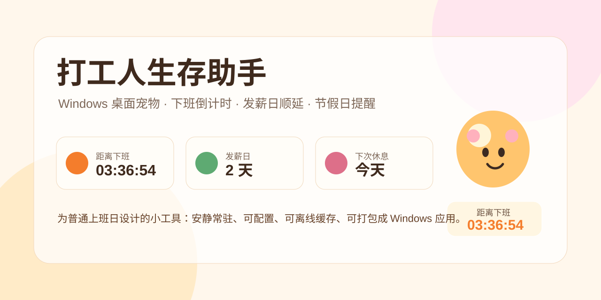

<p align="center">
  
</p>

<h1 align="center">打工人生存助手</h1>

<p align="center">
  一个 Windows 优先的桌面陪伴工具：把下班倒计时、午休提醒、发薪日、休息日和法定节假日放在一个安静的桌面角落。
</p>

<p align="center">
  <a href="#功能亮点">功能亮点</a> ·
  <a href="#截图预览">截图预览</a> ·
  <a href="#快速开始">快速开始</a> ·
  <a href="#windows-打包">Windows 打包</a> ·
  <a href="#路线图">路线图</a>
</p>

## 项目定位

打工人生存助手是一个用 Electron、React 和 TypeScript 构建的桌面应用。它不是复杂的效率系统，而是一个轻量、常驻、可配置的小助手：你可以随时看到距离下班还有多久、午休还剩多久、发薪日还差几天、下一个休息日和法定节假日在哪里。

项目后续计划开源演进，当前版本已经包含可运行的 Windows 解包产物生成流程、核心时间算法测试、设置持久化、托盘和桌面宠物基础能力。

## 功能亮点

| 模块 | 说明 |
| --- | --- |
| 工作倒计时 | 支持上下班时间、午休开始/结束、冬夏季两套作息配置 |
| 发薪日倒计时 | 支持多个发薪日，遇到周末自动顺延到下一个工作日 |
| 休息日计算 | 支持单休、双休和调休余额展示 |
| 法定节假日 | 联网获取中国法定节假日数据，失败时使用缓存或备用数据 |
| 假期弹窗 | 节假日前 3 天提醒，可选择休息天数并计算调休余额 |
| 桌面宠物 | 透明悬浮、始终置顶、可拖动、可调透明度、点击切换显示信息 |
| 系统托盘 | 托盘菜单支持显示/隐藏宠物、打开设置、关于和退出 |
| 开机自启 | 设置页可开启或关闭，保存后实时生效 |

## 截图预览

### 设置与倒计时面板


### 透明悬浮桌面宠物


## 技术栈

- Electron 42
- React 19
- TypeScript 5
- Vite 8
- electron-store
- electron-builder
- Vitest

## 快速开始

```bash
npm install
npm run dev
```

开发模式会同时启动 Vite 和 Electron。应用会打开设置窗口，并创建一个透明悬浮宠物窗口。

## 测试与构建

```bash
npm test
npm run build
npm audit
```

当前仓库验证状态：

- 单元测试：通过
- 生产构建：通过
- 依赖审计：0 vulnerabilities

## Windows 打包

在 Windows 机器上生成安装包和便携版：

```bash
npm install
npm run dist:win
```

产物输出到 `release/`。

如果当前环境无法生成 NSIS 安装包，可以生成 Windows 解包运行目录：

```bash
npm install
npm run dist:win:dir
```

把 `release/win-unpacked/` 整个目录复制到 Windows，双击 `WorkBuddy.exe` 即可运行。应用内仍显示中文名称，exe 文件名使用英文是为了避免部分解压工具处理中文文件名时出现乱码。

## 已知说明

- macOS ARM 环境可以生成 Windows 解包目录，但 NSIS 安装包可能受 `makensis` 架构兼容性影响，建议在 Windows 上执行正式安装包构建。
- 当前宠物形象使用 CSS 绘制，后续可以替换为更完整的多帧动画素材。
- 中国法定节假日数据优先联网获取，网络不可用时会使用本地缓存或备用节日数据。

## 路线图

- [ ] 增加 Windows 原生安装包 CI 构建
- [ ] 增加自动更新检查
- [ ] 完善自定义休息日星期多选
- [ ] 增加可选音效和更多宠物动作
- [ ] 增加多主题皮肤
- [ ] 增加系统通知的防重复触发策略
- [ ] 补充贡献指南和 issue 模板

## 参与贡献

欢迎提交 issue、功能建议和 pull request。建议先运行：

```bash
npm test
npm run build
```

再提交代码。

## License

MIT
